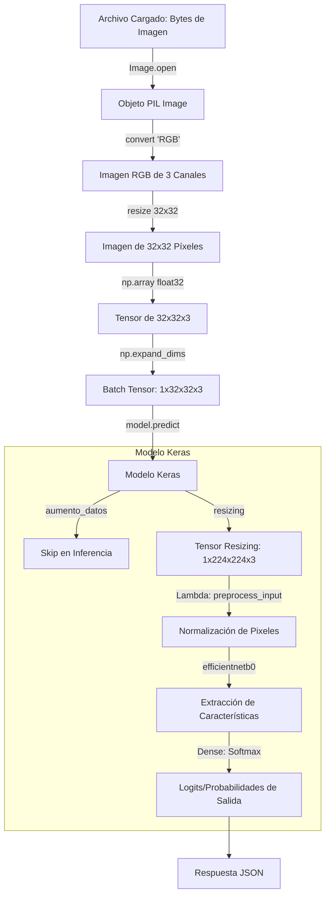

# Arquitectura del Backend y Flujo de Tensores

Este documento detalla el diseño técnico del backend en FastAPI, describiendo el flujo de transformación de los datos desde la imagen cruda recibida hasta la inferencia final, la especificación de los endpoints y las políticas de manejo de excepciones.

---

## 1. Flujo de Transformación de Tensores

La inferencia de imágenes utilizando modelos de Aprendizaje Profundo requiere un riguroso preprocesamiento matemático. El flujo de los tensores se divide en dos fases: el preprocesamiento externo en Python/Pillow y el preprocesamiento interno dentro de las capas del modelo Keras.



### A. Preprocesamiento Externo (Python & Pillow)
1. **Lectura y Conversión de Color:** Los bytes recibidos a través de la API son interpretados por Pillow (`Image.open`). Inmediatamente, la imagen se convierte a formato `RGB` mediante `.convert("RGB")`. Esto elimina el canal alfa (transparencia) en archivos PNG y descarta paletas de colores incompatibles, garantizando siempre 3 canales de color.
2. **Redimensionamiento de Entrada (Resolución CIFAR-10):** El modelo entrenado espera imágenes de $32 \times 32$ píxeles. La imagen se redimensiona a estas dimensiones usando interpolación bilineal de Pillow.
3. **Conversión a Vector y Expansión de Lote:** La imagen redimensionada se transforma en un arreglo numérico de NumPy (`np.array`) con tipo de datos `float32`. Los modelos de Keras requieren un lote (batch) como entrada, por lo que se expande la forma del tensor usando `np.expand_dims(img_array, axis=0)`, lo que transforma la forma de `(32, 32, 3)` a `(1, 32, 32, 3)`.

### B. Preprocesamiento Interno (Capas Incorporadas en el Modelo)
El modelo `modelo_final_cifar10.keras` tiene la ventaja de tener el pipeline de preprocesamiento de ImageNet e incremento de resolución embebido directamente en su arquitectura como capas de Keras:
1. **Capa de Aumento de Datos (`aumento_datos`):** Un contenedor secuencial de Keras (`RandomFlip`, `RandomRotation`, `RandomTranslation`). Durante la inferencia (`training=False`), esta capa actúa simplemente como un bypass y no altera los datos.
2. **Capa de Redimensionamiento (`resizing`):** Toma el tensor de `(1, 32, 32, 3)` y lo escala por hardware a la resolución nativa de EfficientNet: `(1, 224, 224, 3)`.
3. **Capa Lambda (`lambda`):** Envuelve la función `preprocess_input` de EfficientNetB0. Esta función se encarga de reescalar y normalizar los valores de los píxeles (desde la escala `[0, 255]` hasta el rango esperado por EfficientNet).

---

## 2. Estructura del Endpoint y Esquema OpenAPI

El servidor backend expone la siguiente API para interactuar con la interfaz del cliente:

### A. Inferencia de Imágenes
* **Ruta:** `/api/predict`
* **Método:** `POST`
* **Content-Type:** `multipart/form-data`
* **Parámetros:**
  - `file`: Archivo binario de imagen (`UploadFile` de FastAPI).

### B. Esquema de Respuesta JSON (PredictionResponse)
La API responde con un código de estado `200 OK` y el siguiente cuerpo JSON:

```json
{
  "clase_predicha": "Gato",
  "probabilidad_maxima": 88.57,
  "probabilidades_totales": {
    "Avión": 0.05,
    "Automóvil": 0.28,
    "Pájaro": 1.41,
    "Gato": 88.57,
    "Ciervo": 2.19,
    "Perro": 3.4,
    "Rana": 3.48,
    "Caballo": 0.33,
    "Barco": 0.19,
    "Camión": 0.09
  },
  "tiempo_inferencia": 369.31,
  "model_name": "EfficientNetB0 (Fine-Tuning)"
}
```

* **`clase_predicha` (str):** El nombre en español de la categoría con mayor probabilidad (avión, automóvil, pájaro, gato, ciervo, perro, rana, caballo, barco o camión).
* **`probabilidad_maxima` (float):** El porcentaje de certeza de la clase predicha, mapeado al rango de `[0.0, 100.0]`.
* **`probabilidades_totales` (Dict[str, float]):** Un mapeo llave-valor que asocia cada una de las 10 clases de CIFAR-10 con su respectivo porcentaje de probabilidad (útil para generar gráficos de barras en el frontend).
* **`tiempo_inferencia` (float):** El tiempo neto en milisegundos que le tomó a la CPU ejecutar `model.predict()`, medido mediante `time.perf_counter()`.
* **`model_name` (str):** El identificador del modelo utilizado.

---

## 3. Lógica de Manejo de Errores y Excepciones

El backend implementa validaciones estrictas para garantizar la estabilidad de la API y reportar adecuadamente anomalías en las peticiones del cliente:

1. **Archivo no Proporcionado:**
   * Si la petición POST no incluye un parámetro `file`, la API levanta una excepción `HTTP 400 Bad Request`.
2. **Formato de Archivo Inválido (No Imagen):**
   * El servidor verifica la cabecera `content_type` del archivo cargado. Si no comienza con la cadena `"image/"` (por ejemplo, al subir un archivo `.txt` o `.pdf`), la API interrumpe la ejecución inmediatamente y retorna:
     * **Código:** `HTTP 400 Bad Request`
     * **Cuerpo:** `{"detail": "El archivo proporcionado debe ser una imagen. Tipo recibido: text/plain"}`
3. **Imagen Corrupta o Falsificada:**
   * Incluso si el cliente simula la cabecera MIME `image/png`, el backend intenta abrir y analizar la estructura binaria del archivo mediante `Image.open` y el método `.verify()` de Pillow. Si los datos binarios están corruptos o no corresponden a una estructura de imagen real, el servidor retorna:
     * **Código:** `HTTP 400 Bad Request`
     * **Cuerpo:** `{"detail": "El archivo no es una imagen válida o está dañado."}`
4. **Falla en el Servicio de Inferencia:**
   * Si el modelo Keras no pudo cargarse en memoria durante el arranque del servidor (debido a problemas de hardware o falta del archivo `.keras`), la API responde:
     * **Código:** `HTTP 503 Service Unavailable`
     * **Cuerpo:** `{"detail": "El modelo de clasificación no está cargado en el servidor."}`
   * Si ocurre un desbordamiento de memoria u otro error matemático al ejecutar la convolución, el servidor retorna `HTTP 500 Internal Server Error`.
