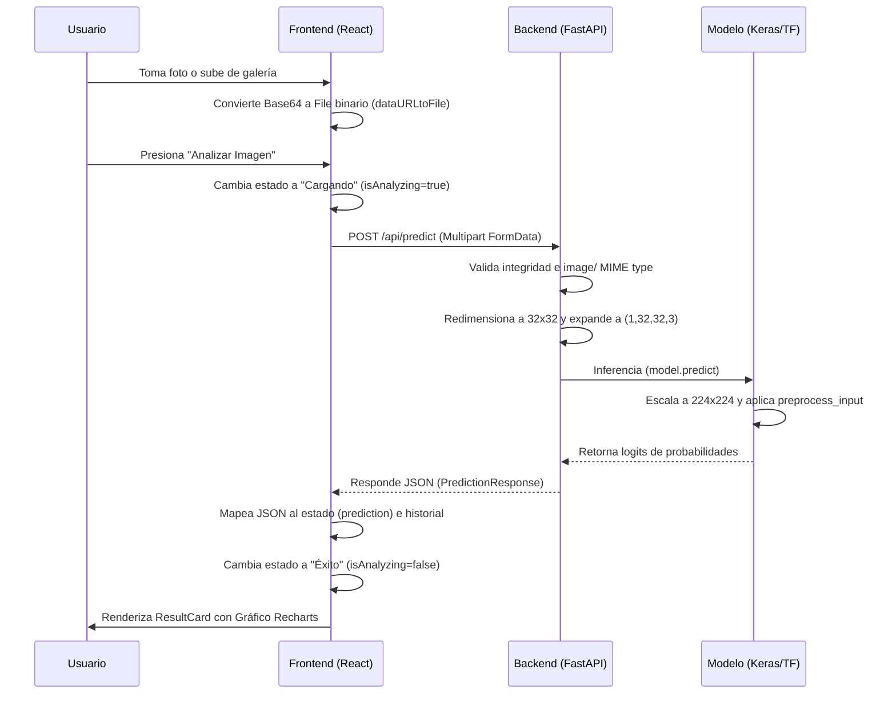

# Integración del Sistema y Visualización de Resultados

Este documento detalla la integración asíncrona entre la interfaz de usuario en React y el backend en FastAPI, describiendo el ciclo de vida de los datos, las peticiones HTTP y la visualización final del gráfico de probabilidades con Recharts.

---

## 1. Flujo de Datos Asíncrono End-to-End

El flujo de información desde que el usuario captura o selecciona una imagen hasta que visualiza el gráfico de barras se describe a continuación:

### A. Preparación del Envío en el Cliente
* Al seleccionar una imagen de la galería, se almacena directamente el objeto `File` nativo.
* Al capturar una foto con la cámara web, la API del canvas entrega una URI de tipo Data URL (Base64). Para mantener la compatibilidad con el backend, la función `dataURLtoFile` decodifica la cadena y genera un objeto `File` equivalente en memoria.
* Al hacer clic en "Analizar Imagen", la aplicación desactiva los controles de entrada, activa el estado `isAnalyzing` para pintar el **Skeleton Loader** y empaqueta el archivo en un objeto `FormData` con la clave `"file"`.

### B. Transmisión HTTP y Ejecución en el Servidor
* La petición se envía asíncronamente con `fetch` hacia el endpoint `http://localhost:8000/api/predict` mediante el método `POST`.
* El backend de FastAPI intercepta los bytes, verifica el tipo MIME, realiza el redimensionamiento a $32 \times 32$ y ejecuta la inferencia con TensorFlow.
* El backend retorna una estructura JSON detallando la clase predicha, la certeza máxima (0-100%), las probabilidades de cada una de las 10 clases en formato de diccionario, y el tiempo de inferencia consumido.

### C. Consumo y Renderizado en el Gráfico
* Al recibir el JSON con estado de éxito (`200 OK`), el cliente almacena la respuesta en el estado local de React, lo que desmonta los loaders y monta el componente `ResultCard`.
* El diccionario `probabilidades_totales` se transforma en una estructura de arreglo plano de objetos `{ name, probability }`.
* El arreglo se ordena de manera descendente para alimentar al componente de gráficos.

---

## 2. Especificación de la Librería de Gráficos (Recharts)

Para cumplir con la directiva de utilizar una librería de gráficos ligera y declarativa en React, se seleccionó **Recharts** (v3.x).

### Configuración Técnica Implementada:
1. **Contenedor Responsivo (`ResponsiveContainer`):**
   Envuelve todo el gráfico con propiedades de ancho y alto al `100%`. Esto asegura que el gráfico se adapte fluidamente a la tarjeta del contenedor simulado del móvil sin causar desbordamientos horizontales.
2. **Representación Horizontal (`layout="vertical"`):**
   Configura el `<BarChart>` en modo vertical, lo que invierte los ejes de manera que las categorías se listan en el eje vertical (Y) y los porcentajes en el eje horizontal (X), facilitando la lectura en pantallas angostas.
3. **Eje de Categorías (`YAxis`):**
   * Se enlaza a la clave `name` del arreglo.
   * Se asigna un ancho estático `width={80}` que garantiza que los nombres en español de las clases de CIFAR-10 (como "Automóvil" o "Caballo") no sean recortados por el margen izquierdo del SVG.
   * Se desactiva la línea del eje (`axisLine={false}`) y marcas (`tickLine={false}`) para mantener un aspecto moderno y limpio.
4. **Eje de Valores (`XAxis`):**
   * Se configura con tipo numérico y un dominio fijo de `[0, 100]`.
   * Un formateador de etiquetas agrega el sufijo `%` a los intervalos.
5. **Barras Dinámicas (`Bar` & `Cell`):**
   * Se asigna un radio curvado en las puntas (`radius={[0, 4, 4, 0]}`) para emular barras de sistemas operativos nativos.
   * Implementa una directiva de renderizado condicional mediante `<Cell />`: la categoría ganadora (con mayor probabilidad) se resalta con el color púrpura de acento (`#8b5cf6`) al 100% de opacidad, mientras que las otras 9 clases se pintan en color pizarra apagado (`#475569`) con opacidad al 60%, logrando una jerarquía visual inmediata.
6. **Tooltip Flotante Personalizado (`Tooltip`):**
   * Se reemplaza la ventana emergente por defecto por una función de renderizado propia (`CustomTooltip`).
   * Adopta los estilos estéticos del proyecto: fondo oscuro semitransparente con desenfoque de fondo (`backdrop-blur-md bg-slate-950/90`), bordes grises suaves y texto de alta legibilidad en color violeta para el porcentaje.
